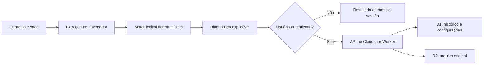

# NexoCV

[](https://github.com/hashickzvictorhugo/Curriculo/actions/workflows/ci.yml)
[](https://github.com/hashickzvictorhugo/Curriculo/actions/workflows/codeql.yml)

**NexoCV transforma currículo e descrição de vaga em um diagnóstico textual,
explicável e acionável — sem prometer prever uma contratação.**

[Acessar demonstração](https://nexocv-vagas.duraesalvesvictorhug.chatgpt.site)


## O problema

Quem está procurando trabalho costuma saber que precisa adaptar o currículo,
mas não enxerga com clareza quais evidências estão faltando. O NexoCV compara o
conteúdo informado com cargo, vaga e contexto profissional da empresa para
mostrar:

- competências encontradas e ausentes;
- aderência aos termos específicos da vaga;
- evidências de experiência, formação e resultados mensuráveis;
- conexão com setor e prioridades informadas da empresa;
- próximos ajustes que podem tornar o currículo mais claro.

O resultado é orientativo. A aplicação não classifica pessoas, não usa o nome da
empresa como atalho para a nota e não substitui uma avaliação humana.

## Funcionalidades

- leitura de currículos em PDF, DOCX, TXT e Markdown no navegador;
- catálogo de ocupações e suporte a cargos personalizados;
- comparação com a descrição real da vaga;
- composição de nota por dimensões e pesos visíveis;
- histórico privado para usuários autenticados;
- persistência estruturada em D1 e arquivos protegidos em R2;
- painel administrativo para conteúdo, catálogos e pesos;
- compartilhamento voluntário de um resumo pelo WhatsApp.

## Arquitetura



A interface React é renderizada com vinext. PDF.js e Mammoth extraem texto no
cliente; o motor em TypeScript produz a análise; e as rotas autenticadas isolam
o histórico pelo identificador da conta. Veja os detalhes e limites de confiança
em [`docs/architecture.md`](docs/architecture.md).

## Stack e decisões

| Camada | Tecnologia | Motivo |
| --- | --- | --- |
| Interface | React 19, TypeScript e Tailwind CSS | UI tipada e responsiva |
| Aplicação | vinext e Vite | App Router executado no edge |
| Execução | Cloudflare Workers | baixa latência e integração com armazenamento |
| Dados | Cloudflare D1 e Drizzle ORM | histórico relacional e migrações versionadas |
| Arquivos | Cloudflare R2 | armazenamento privado dos currículos salvos |
| Extração | PDF.js e Mammoth | leitura local de PDF e DOCX |
| Qualidade | Node Test Runner, ESLint, TypeScript e GitHub Actions | validação reproduzível a cada mudança |

O motor é lexical e determinístico, não um modelo generativo. Isso facilita
explicar cada dimensão e repetir o resultado, mas também impõe limitações de
sinônimos, contexto e formatação. A fórmula completa está documentada em
[`docs/algorithm.md`](docs/algorithm.md).

## Qualidade

Os testes exercitam comportamento público e regras centrais, incluindo:

- renderização real do produto compilado;
- estabilidade do resultado para a mesma entrada;
- evidências de uma vaga full stack com TypeScript, React, REST e SQL;
- fallback seguro para uma configuração de pesos zerada;
- reconhecimento de resultados mensuráveis;
- garantia de que o nome da empresa, isoladamente, não altera a nota.

CI executa lint, checagem de tipos, build e testes em cada pull request. CodeQL e
Dependabot complementam a manutenção contínua.

## Desenvolvimento local

Pré-requisitos recomendados: Node.js 24 (versão usada na CI) e pnpm 11. A
aplicação declara compatibilidade de execução a partir do Node.js 22.13.

```bash
pnpm install --frozen-lockfile
pnpm dev
```

Verificações disponíveis:

```bash
pnpm lint
pnpm typecheck
pnpm build
pnpm test:unit
pnpm ci
```

Para habilitar o painel administrativo localmente, copie `.env.example` e
configure os IDs estáveis das contas autorizadas em `ADMIN_USER_IDS`. Não envie
identificadores reais ou credenciais ao repositório.
Os vínculos de D1 e R2 usados no ambiente hospedado ficam declarados em
`.openai/hosting.json`; as migrações estão em `drizzle/`.

## Estrutura do projeto

```text
app/                 interface, autenticação e rotas HTTP
db/                  esquema relacional e acesso ao D1
drizzle/             migrações versionadas
lib/                 motor de análise, catálogos e configurações
tests/               testes comportamentais e de renderização
worker/              entrada do Cloudflare Worker
docs/                arquitetura, algoritmo, privacidade e decisões
```

## Privacidade e segurança

Sem login, a análise permanece no navegador. Com login, o resultado entra no
histórico privado e, quando há upload, o arquivo original é armazenado no R2. O
fluxo completo, os dados tratados e as limitações atuais estão descritos em
[`docs/privacy.md`](docs/privacy.md). Vulnerabilidades devem seguir o processo de
[`SECURITY.md`](SECURITY.md).

## Roadmap honesto

- exclusão e exportação self-service do histórico;
- testes de integração para D1 e R2;
- reprocessamento verificável no servidor para resultados persistidos;
- melhoria gradual do reconhecimento de variações linguísticas;
- observabilidade de falhas sem registrar conteúdo de currículos.

## Transparência sobre IA

Ferramentas de IA generativa apoiaram ideação, revisão de interface,
documentação e implementação. As regras do produto, integrações, validações e
testes permanecem inspecionáveis no repositório. O diagnóstico do NexoCV em si é
calculado por regras determinísticas locais; ele não envia o currículo a um
modelo de IA para gerar a nota.

---

Projeto de portfólio de **Victor Hugo Durães**, construído para demonstrar
produto, engenharia full stack, segurança e comunicação técnica.
