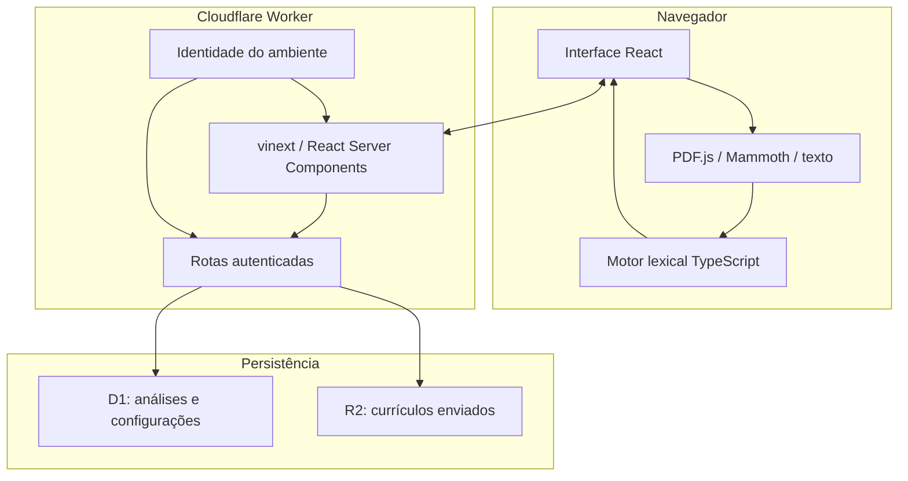

# Arquitetura do NexoCV

## Visão geral

O NexoCV separa a experiência interativa, o cálculo explicável e a persistência
autenticada. A extração e a análise acontecem primeiro no navegador. O backend
entra no fluxo quando uma conta autenticada precisa salvar ou consultar o
histórico e quando uma conta autorizada administra o conteúdo do produto.

## Responsabilidades

### Interface

- coleta empresa, setor, cargo, descrição da vaga e currículo;
- extrai texto de PDF e DOCX no dispositivo;
- chama o motor determinístico e apresenta as evidências;
- envia o resultado e o arquivo para persistência quando o usuário está logado.

### Motor de compatibilidade

- normaliza texto e compara requisitos conhecidos;
- calcula dimensões com pesos configuráveis;
- gera pontos fortes, lacunas e recomendações a partir de regras;
- não faz chamadas de rede nem depende de um modelo generativo.

### Backend no edge

- recebe a identidade encaminhada pelo ambiente de hospedagem;
- restringe leituras de histórico ao identificador da conta;
- persiste metadados e resultados no D1;
- armazena o arquivo original no R2;
- controla versões da configuração administrativa.

## Fronteiras de confiança

1. **Entrada do usuário:** arquivo e textos são conteúdo não confiável e devem
   permanecer sujeitos a limites, parsing defensivo e validação.
2. **Navegador → API:** o resultado é produzido no cliente. O histórico é útil
   para o próprio usuário, mas não deve ser tratado como uma certificação ou
   pontuação inviolável.
3. **Identidade → aplicação:** somente os cabeçalhos fornecidos pelo ambiente de
   hospedagem compõem a identidade; valores enviados diretamente pelo cliente
   não devem conceder acesso.
4. **D1/R2:** registros e objetos precisam ser sempre acessados com o ID do
   proprietário, sem depender de nome de arquivo ou e-mail informado pelo
   navegador.

## Persistência

- `analyses`: histórico por usuário, metadados da vaga e JSON do diagnóstico;
- `site_settings_versions`: revisões imutáveis da configuração pública;
- R2 `RESUMES`: arquivo original sob uma chave que começa pelo ID do usuário.

As alterações de esquema são versionadas em `drizzle/`. A aplicação lê no máximo
20 análises recentes por requisição de histórico.

## Operação e qualidade

- CI bloqueia regressões de lint, tipos, build e testes;
- CodeQL faz análise estática de JavaScript e TypeScript;
- Dependabot acompanha dependências e GitHub Actions;
- migrações e configuração de infraestrutura permanecem no repositório;
- conteúdo de currículo não deve ser incluído em logs ou telemetria.

## Decisões relacionadas

- [`ADR 0001 — motor lexical determinístico no navegador`](adr/0001-client-side-deterministic-analysis.md)
- [`Algoritmo e limitações`](algorithm.md)
- [`Privacidade e ciclo dos dados`](privacy.md)
